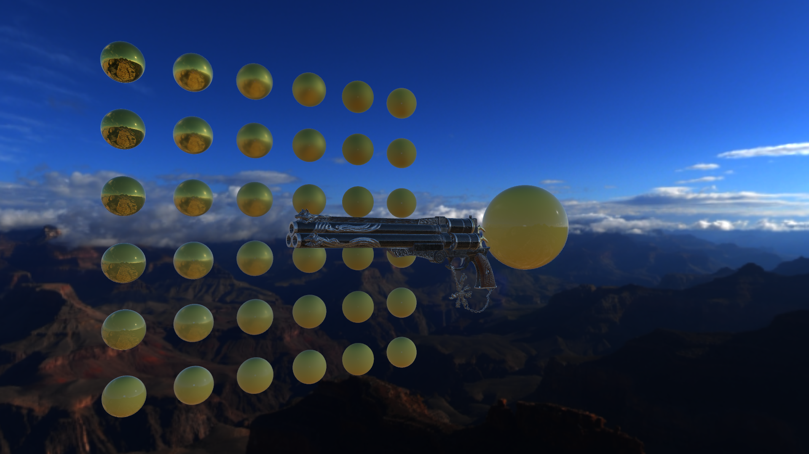
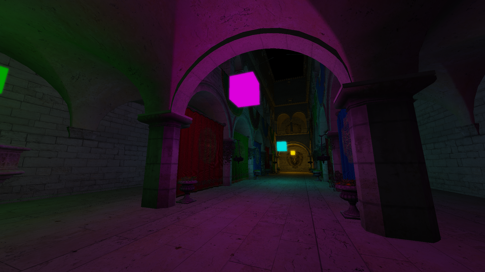

# opengl-demos

Just a bunch of opengl demos

# Installation 

1. Clone or download the repo onto your computer
2. Build with cmake

# Controls
Press ESC to toggle menu  
Scroll wheel changes FOV  
# TODO:
1. Skeletal Animation  
2. Screen space reflections  
3. Depth of field
# Photos:
 
 
